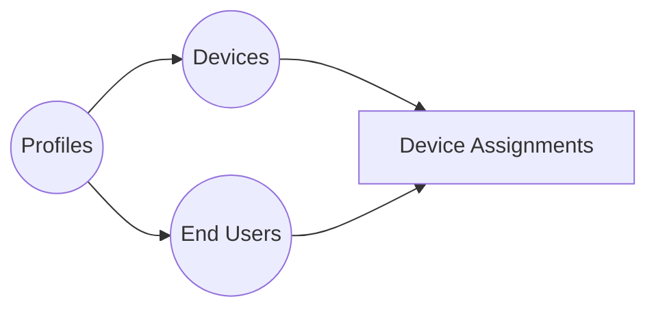

# 🖥️ IT Assets Management — Device Dashboard

Ứng dụng web quản lý tài sản IT (thiết bị, phần cứng) xây dựng trên **Next.js 16** + **Supabase**. Giao diện hiện đại, hỗ trợ import/export Excel, quản lý CRUD, thiết bị & người dùng, dark/light mode, và xác thực.

---

## 📑 Mục lục

- [✨ Tính năng chính](#-tính-năng-chính)
- [🛠️ Tech Stack](#️-tech-stack)
- [📁 Cấu trúc dự án](#-cấu-trúc-dự-án)
- [🚀 Bắt đầu](#-bắt-đầu)
  - [Yêu cầu hệ thống](#yêu-cầu-hệ-thống)
  - [1. Clone & Cài đặt](#1-clone--cài-đặt)
  - [2. Thiết lập Database](#2-thiết-lập-database)
  - [3. Cấu hình Environment](#3-cấu-hình-environment)
  - [4. Chạy ứng dụng](#4-chạy-ứng-dụng)
- [🗄️ Database Schema](#️-database-schema)
- [🐳 Docker Deployment](#-docker-deployment)
- [⚙️ Environment Variables](#️-environment-variables)
- [📄 License](#-license)
- [🤝 Đóng góp](#-đóng-góp)

---

## ✨ Tính năng chính

| Tính năng | Mô tả |
|---|---|
| 🔐 **Xác thực người dùng** | Đăng nhập / Đăng ký qua Supabase Auth, bảo vệ route bằng Middleware |
| 📊 **Dashboard tổng quan** | Biểu đồ thống kê thiết bị, hoạt động gần đây, tổng quan phần cứng |
| 📥 **Import Excel** | Kéo thả file `.xlsx` — hỗ trợ import nhiều files, chọn sheets trước khi import |
| ➕ **Quản lý Thiết bị** | CRUD thiết bị, sắp xếp, tìm kiếm, lọc theo trạng thái, phân trang |
| 👤 **Quản lý End-User** | Tạo hồ sơ người dùng cuối (nhân viên), phòng ban, chức vụ |
| 🤝 **Bàn giao (Assignment)** | Gán thiết bị cho End-User (1:1 hoặc 1:N), theo dõi lịch sử bàn giao/thu hồi |
| 🔍 **Xem chi tiết** | Modal hiển thị thông tin thiết bị với thông số kỹ thuật (JSONB) |
| ☑️ **Thao tác hàng loạt** | Chọn nhiều thiết bị → đổi trạng thái / xuất file / xóa cùng lúc |
| 📤 **Xuất Excel/CSV** | Xuất dữ liệu thiết bị ra file để báo cáo |
| 🎨 **Dark / Light mode** | Tuỳ chỉnh giao diện, đồng bộ theme giữa các phiên đăng nhập |
| ⌨️ **Command Palette** | Tìm kiếm nhanh và điều hướng bằng `Ctrl+K` |

---

## 🛠️ Tech Stack

| Lớp | Công nghệ |
|---|---|
| **Framework** | Next.js 16.1.1 (App Router), React 19, TypeScript 5.9 |
| **Styling** | Tailwind CSS 4.x, shadcn/ui (Radix UI) |
| **Backend** | Supabase (Auth + PostgreSQL + Storage) |
| **ORM** | Drizzle ORM |
| **State** | React Query (TanStack), Zustand |
| **Data** | SheetJS (xlsx), TanStack Table, TanStack Virtual |
| **Validation** | React Hook Form + Zod |

---

## 📁 Cấu trúc dự án

<details>
<summary>📂 Click để xem cấu trúc thư mục chi tiết</summary>

```
device-dashboard/
├── public/                  # Static assets
├── docker/
│   └── init.sql             # Database initialization script
├── src/
│   ├── app/
│   │   ├── (auth)/          # Trang Login/Register
│   │   ├── (dashboard)/     # Trang quản lý (Protected)
│   │   │   ├── dashboard/   # Tổng quan
│   │   │   ├── devices/     # Quản lý thiết bị
│   │   │   ├── users/       # Quản lý End-Users
│   │   │   ├── settings/    # Cài đặt
│   │   │   └── layout.tsx   # Dashboard Shell (Sidebar)
│   │   ├── actions/         # Server Actions (Logic chính)
│   │   │   ├── auth.ts
│   │   │   ├── devices.ts
│   │   │   ├── device-assignments.ts
│   │   │   └── end-users.ts
│   │   ├── api/             # API routes (ít dùng, chủ yếu dùng Actions)
│   │   └── globals.css      # CSS variables
│   ├── components/
│   │   ├── auth/            # Auth forms
│   │   ├── dashboard/       # Feature components (DeviceList, UserTable...)
│   │   ├── ui/              # shadcn/ui primitives
│   │   └── app-sidebar.tsx  # Sidebar navigation
│   ├── db/                  # Database definition
│   │   ├── schema.ts        # Drizzle Schema
│   │   └── drizzle.ts       # DB Client
│   ├── hooks/               # Custom React hooks (useDevicesQuery...)
│   ├── stores/              # Zustand stores (UI state)
│   ├── types/               # TypeScript definitions
│   ├── lib/                 # Utility functions (Excel, formatting)
│   └── utils/               # Supabase client helpers
├── docker-compose.yml       # Docker services
├── package.json
└── README.md
```

</details>

---

## 🚀 Bắt đầu

### Yêu cầu hệ thống

| Phần mềm | Phiên bản | Ghi chú |
|---|---|---|
| **Node.js** | >= 18.x | [Tải tại đây](https://nodejs.org/) |
| **Docker** | Latest | Chỉ cần nếu self-host database |

### 1. Clone & Cài đặt

```bash
git clone https://github.com/duacacao/IT_Asset_Management.git
cd device-dashboard
npm install
```

### 2. Thiết lập Database

Xem file `docker/init.sql` để biết cấu trúc bảng cần tạo trên Supabase hoặc Docker Postgres.

### 3. Cấu hình Environment

```bash
cp .env.example .env.local
# Điền NEXT_PUBLIC_SUPABASE_URL và ANON_KEY
```

### 4. Chạy ứng dụng

```bash
npm run dev
# Truy cập: http://localhost:3000
```

---

## 🗄️ Database Schema

<details>
<summary>📊 Click để xem sơ đồ Database (5 bảng chính)</summary>

### Tổng quan



### 1. `profiles` (App Users)

Người dùng đăng nhập vào hệ thống (Admin/Staff). Liên kết với `auth.users`.

### 2. `devices` (Thiết bị)

| Cột | Type | Mô tả |
|---|---|---|
| `id` | UUID | PK |
| `code` | TEXT | Mã tài sản (Unique) |
| `name` | TEXT | Tên thiết bị |
| `status` | TEXT | `active`, `broken`, `sold`... |
| `specs` | JSONB | Thông số kỹ thuật chi tiết |
| `owner_id` | UUID | FK -> profiles (Người tạo/quản lý) |

### 3. `end_users` (Người sử dụng thiết bị)

Nhân viên trong công ty được cấp phát thiết bị.

| Cột | Type | Mô tả |
|---|---|---|
| `id` | UUID | PK |
| `full_name` | TEXT | Tên nhân viên |
| `department_id`| UUID | FK -> departments |
| `position_id` | UUID | FK -> positions |

### 4. `device_assignments` (Bàn giao)

Lịch sử gán thiết bị.

| Cột | Type | Mô tả |
|---|---|---|
| `device_id` | UUID | FK -> devices |
| `end_user_id` | UUID | FK -> end_users |
| `assigned_at` | TIMESTAMP | Ngày bàn giao |
| `returned_at` | TIMESTAMP | Ngày trả (NULL = Đang sử dụng) |

</details>

---

## 🐳 Docker Deployment

Xem file `docker-compose.yml` để chạy stack local với PostgreSQL.

---

## 📄 License

[MIT](./License.md)
