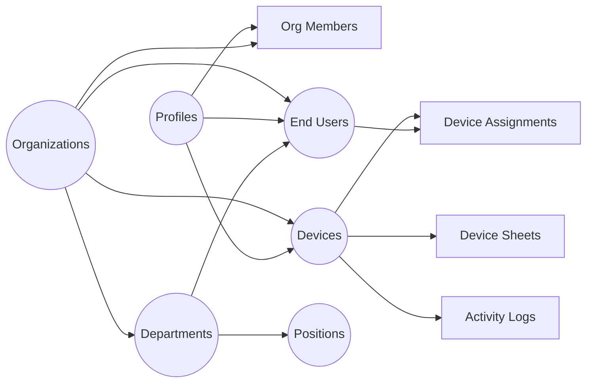

# IT Assets Management — Device Dashboard

Ứng dụng web quản lý tài sản IT (thiết bị, phần cứng) xây dựng trên **Next.js 16** + **Supabase**. Hỗ trợ multi-tenant, phân quyền RBAC, import/export Excel, sơ đồ tổ chức, realtime sync, và giao diện Soft Premium với dark/light mode.

---

## Mục lục

- [Tính năng chính](#tính-năng-chính)
- [Tech Stack](#tech-stack)
- [Cấu trúc dự án](#cấu-trúc-dự-án)
- [Bắt đầu](#bắt-đầu)
  - [Yêu cầu hệ thống](#yêu-cầu-hệ-thống)
  - [1. Clone & Cài đặt](#1-clone--cài-đặt)
  - [2. Thiết lập Database](#2-thiết-lập-database)
  - [3. Cấu hình Environment](#3-cấu-hình-environment)
  - [4. Chạy ứng dụng](#4-chạy-ứng-dụng)
- [Database Schema](#database-schema)
- [Hệ thống phân quyền (RBAC)](#hệ-thống-phân-quyền-rbac)
- [Docker Deployment](#docker-deployment)
- [License](#license)

---

## Tính năng chính

### Xác thực & Phân quyền

| Tính năng                       | Mô tả                                                                                     |
| ------------------------------- | ----------------------------------------------------------------------------------------- |
| **Xác thực người dùng**         | Đăng nhập / Đăng ký qua Supabase Auth, bảo vệ route bằng Middleware                       |
| **Multi-tenant (Organization)** | Mỗi tài khoản thuộc 1 tổ chức, dữ liệu cách ly hoàn toàn giữa các tổ chức qua RLS         |
| **Phân quyền RBAC**             | 4 role: Owner > Admin > Member > Viewer — kiểm soát quyền đọc/ghi/quản trị                |
| **Quản lý thành viên**          | Admin+ có thể thêm/xoá thành viên, thay đổi role, reset mật khẩu (Settings > Permissions) |

### Quản lý Thiết bị

| Tính năng                   | Mô tả                                                                                               |
| --------------------------- | --------------------------------------------------------------------------------------------------- |
| **CRUD thiết bị**           | Tạo, xem, sửa, xoá thiết bị với form accordion và floating card layout                              |
| **Trang chi tiết thiết bị** | Trang riêng `/device/[id]` hiển thị thông tin tổng quan, thông số kỹ thuật (JSONB), và sheets       |
| **Dynamic detail cards**    | Hiển thị thông tin chi tiết khác nhau tuỳ theo loại thiết bị (PC, Laptop, v.v.)                     |
| **Device Sheets**           | Quản lý bảng tính (spreadsheet-like) gắn với thiết bị — thêm/xoá dòng, sửa cell, đổi tên, sắp xếp   |
| **Import Excel**            | Kéo thả file `.xlsx` — hỗ trợ import nhiều files, chọn sheets trước khi import, soft-delete khi lỗi |
| **Xuất Excel/CSV**          | Xuất dữ liệu thiết bị ra file CSV (UTF-8 BOM tương thích Excel)                                     |
| **Thao tác hàng loạt**      | Chọn nhiều thiết bị -> đổi trạng thái / xoá cùng lúc                                                |
| **Menu 3-dot actions**      | Menu hành động nhanh trên mỗi dòng thiết bị                                                         |
| **Tìm kiếm & Lọc**          | Tìm kiếm, lọc theo trạng thái, sắp xếp, phân trang                                                  |
| **Soft delete**             | Xoá mềm thiết bị (lưu `deleted_at`), không mất dữ liệu vĩnh viễn                                    |

### Quản lý Nhân viên (End-User)

| Tính năng                      | Mô tả                                                                |
| ------------------------------ | -------------------------------------------------------------------- |
| **CRUD nhân viên**             | Tạo hồ sơ nhân viên (tên, email, phone, ghi chú)                     |
| **Bàn giao thiết bị**          | Gán thiết bị cho nhân viên (1:1 hoặc 1:N), hỗ trợ smart reassignment |
| **Thu hồi thiết bị**           | Thu hồi thiết bị từ nhân viên, tự động cập nhật trạng thái           |
| **Bàn giao/Thu hồi hàng loạt** | Gán hoặc thu hồi nhiều thiết bị cùng lúc                             |
| **Lịch sử bàn giao**           | Theo dõi lịch sử bàn giao/thu hồi thiết bị                           |
| **Dữ liệu cách ly**            | Dữ liệu nhân viên cách ly theo tài khoản/tổ chức                     |

### Phòng ban & Chức vụ

| Tính năng             | Mô tả                                                                                           |
| --------------------- | ----------------------------------------------------------------------------------------------- |
| **Quản lý phòng ban** | CRUD phòng ban với cấu trúc phân cấp (parent-child)                                             |
| **Quản lý chức vụ**   | CRUD chức vụ/vị trí công việc trong phòng ban                                                   |
| **Sơ đồ tổ chức**     | Hiển thị sơ đồ tổ chức tương tác (Organization Chart) sử dụng @xyflow/react + dagre auto-layout |

### Dashboard & Thống kê

| Tính năng                       | Mô tả                                                                  |
| ------------------------------- | ---------------------------------------------------------------------- |
| **Dashboard tổng quan**         | Biểu đồ thống kê thiết bị (Recharts), thẻ KPI, hoạt động gần đây       |
| **Biểu đồ trạng thái thiết bị** | Chart hiển thị phân bố trạng thái thiết bị                             |
| **Biểu đồ phòng ban**           | Chart thống kê nhân viên theo phòng ban                                |
| **Hoạt động gần đây**           | Feed hiển thị các hành động gần nhất (import, bàn giao, thu hồi, v.v.) |

### Giao diện & Trải nghiệm

| Tính năng                 | Mô tả                                                                            |
| ------------------------- | -------------------------------------------------------------------------------- |
| **Soft Premium UI**       | Giao diện thiết kế phong cách premium, nhất quán toàn bộ ứng dụng                |
| **Dark / Light mode**     | Chuyển đổi giao diện sáng/tối với hiệu ứng chuyển đổi tròn (circular transition) |
| **Theme Customizer**      | Tuỳ chỉnh màu sắc, border-radius, font, sidebar layout, nhiều theme presets      |
| **Command Palette**       | Tìm kiếm nhanh và điều hướng bằng `Ctrl+K` (cmdk)                                |
| **Breadcrumb navigation** | Điều hướng breadcrumb trên mỗi trang                                             |
| **Responsive**            | Hỗ trợ mobile và desktop                                                         |
| **Toast notifications**   | Thông báo hành động với soft toast variant (Sonner)                              |
| **Loading states**        | Trạng thái loading nhất quán toàn project                                        |
| **Empty states**          | Component hiển thị khi không có dữ liệu                                          |

### Hệ thống & Bảo mật

| Tính năng                 | Mô tả                                                                                     |
| ------------------------- | ----------------------------------------------------------------------------------------- |
| **Realtime sync**         | Supabase Realtime subscriptions cho devices, assignments, end-users — tự động cập nhật UI |
| **Activity Logs**         | Ghi log mọi hành động (import, assign, return, v.v.) với retention 30 ngày                |
| **Cron cleanup**          | API endpoint tự động xoá log cũ hơn 30 ngày                                               |
| **Security headers**      | CSP (Content Security Policy), HSTS                                                       |
| **Zod validation**        | Validate dữ liệu đầu vào bằng Zod ở server-side                                           |
| **requireAuth helper**    | Kiểm tra auth + org + role ở mọi Server Action                                            |
| **Atomic DB operations**  | Sử dụng Postgres RPC functions để tránh race conditions (JSONB)                           |
| **Row Level Security**    | RLS trên tất cả các bảng, đảm bảo cách ly dữ liệu giữa các tổ chức                        |
| **Tài liệu hướng dẫn**    | Hệ thống docs tích hợp (MDX) với 7 bài hướng dẫn chi tiết                                 |
| **Vercel Speed Insights** | Theo dõi hiệu năng ứng dụng trên production                                               |

---

## Tech Stack

| Lớp                    | Công nghệ                                                |
| ---------------------- | -------------------------------------------------------- |
| **Framework**          | Next.js 16.1.1 (App Router), React 19, TypeScript 5.9    |
| **Styling**            | Tailwind CSS 4.x, shadcn/ui (Radix UI), 34 UI components |
| **Backend**            | Supabase (Auth + PostgreSQL + Realtime + RLS)            |
| **State**              | TanStack React Query 5, Zustand 5                        |
| **Forms**              | React Hook Form 7 + Zod 4                                |
| **Data Import/Export** | SheetJS (xlsx) — dynamic import, react-dropzone          |
| **Tables**             | TanStack Table                                           |
| **Charts**             | Recharts 3                                               |
| **Org Chart**          | @xyflow/react 12 + dagre (auto-layout)                   |
| **Docs**               | next-mdx-remote + gray-matter (MDX)                      |
| **Theming**            | next-themes, custom theme customizer                     |
| **Command Palette**    | cmdk                                                     |
| **Testing**            | Vitest, Playwright                                       |
| **Linting**            | ESLint, Prettier, Husky + lint-staged                    |
| **Analytics**          | Vercel Speed Insights                                    |

---

## Cấu trúc dự án

<details>
<summary>Click để xem cấu trúc thư mục chi tiết</summary>

```
device-dashboard/
├── public/                          # Tài nguyên tĩnh
├── docker/
│   └── init.sql                     # Script khởi tạo Database
├── docs/                            # Tài liệu MDX (7 bài hướng dẫn)
├── src/
│   ├── app/
│   │   ├── (auth)/                  # Trang xác thực (Đăng nhập, Đăng ký, Lỗi)
│   │   │   ├── sign-in/
│   │   │   ├── sign-up/
│   │   │   └── errors/              # 401, 403, 404, 500, Bảo trì
│   │   ├── (dashboard)/             # Trang quản lý (Protected)
│   │   │   ├── dashboard/           # Tổng quan — Thẻ KPI, biểu đồ
│   │   │   ├── devices/             # Danh sách thiết bị
│   │   │   ├── device/[id]/         # Chi tiết thiết bị
│   │   │   ├── end-user/            # Quản lý nhân viên
│   │   │   ├── department/          # Phòng ban & Chức vụ
│   │   │   ├── organization/        # Sơ đồ tổ chức
│   │   │   ├── docs/                # Tài liệu hướng dẫn
│   │   │   │   └── [slug]/          # Trang doc riêng
│   │   │   ├── settings/
│   │   │   │   ├── account/         # Cài đặt tài khoản
│   │   │   │   ├── appearance/      # Giao diện & Theme
│   │   │   │   ├── history/         # Lịch sử hệ thống
│   │   │   │   └── permissions/     # Quản trị & Phân quyền (Admin+)
│   │   │   └── users/               # Quản lý users
│   │   ├── actions/                 # Server Actions (12 files)
│   │   │   ├── auth.ts              # Đăng nhập/Đăng ký/Đăng xuất
│   │   │   ├── devices.ts           # CRUD + import + thao tác hàng loạt
│   │   │   ├── device-sheets.ts     # Thao tác bảng tính
│   │   │   ├── device-assignments.ts # Bàn giao/Thu hồi
│   │   │   ├── end-users.ts         # CRUD nhân viên
│   │   │   ├── departments.ts       # CRUD phòng ban
│   │   │   ├── positions.ts         # CRUD chức vụ
│   │   │   ├── members.ts           # Quản lý thành viên tổ chức
│   │   │   ├── organization.ts      # Hierarchy cho sơ đồ tổ chức
│   │   │   ├── activity-logs.ts     # Nhật ký + dọn dẹp
│   │   │   ├── app-stats.ts         # Thống kê Dashboard
│   │   │   └── profile.ts           # Hồ sơ + cài đặt
│   │   └── api/
│   │       ├── auth/me/             # GET người dùng hiện tại
│   │       └── cron/cleanup-logs/   # Cron xoá log cũ
│   ├── components/
│   │   ├── ui/                      # 34 shadcn/ui components
│   │   ├── auth/                    # Form xác thực
│   │   ├── dashboard/               # Components: Thiết bị, Nhân viên, Phòng ban, Thành viên, Sơ đồ tổ chức
│   │   ├── permission/              # PermissionGate, RoleBadge
│   │   ├── carousel/                # Sheet tabs carousel
│   │   ├── theme-customizer/        # Giao diện tuỳ chỉnh theme
│   │   ├── app-sidebar.tsx          # Sidebar điều hướng (theo role)
│   │   ├── CommandPalette.tsx       # Command palette Ctrl+K
│   │   └── ...                      # Logo, ModeToggle, EmptyState, v.v.
│   ├── hooks/
│   │   ├── queries/                 # TanStack Query hooks (thiết bị, nhân viên, tổ chức, logs, stats)
│   │   ├── mutations/               # TanStack Mutation hooks (thiết bị, nhân viên, thành viên)
│   │   ├── usePermission.ts         # RBAC permission hooks
│   │   └── ...                      # Mobile, sidebar, theme hooks
│   ├── stores/                      # Zustand stores (giao diện, UI state)
│   ├── contexts/                    # AuthContext, SidebarContext, ThemeContext
│   ├── providers/                   # QueryProvider, RealtimeProvider
│   ├── types/                       # TypeScript definitions (supabase, device, end-user, permission, v.v.)
│   ├── lib/                         # Utilities (auth, permissions, excel, export, docs, time, v.v.)
│   ├── config/                      # Cấu hình theme & presets
│   ├── constants/                   # Hằng số: Device, EndUser, ActivityLog
│   └── utils/                       # Supabase client helpers, theme presets
├── test/                            # File test
├── docker-compose.yml               # Docker services
├── Dockerfile                       # Docker build
├── vercel.json                      # Cấu hình Vercel
├── vitest.config.ts                 # Cấu hình Vitest
├── package.json
└── README.md
```

</details>

---

## Bắt đầu

### Yêu cầu hệ thống

| Phần mềm    | Phiên bản | Ghi chú                            |
| ----------- | --------- | ---------------------------------- |
| **Node.js** | >= 18.x   | [Tải tại đây](https://nodejs.org/) |
| **Docker**  | Latest    | Chỉ cần nếu self-host database     |

### 1. Clone & Cài đặt

```bash
git clone https://github.com/duacacao/IT_Asset_Management.git
cd device-dashboard
npm install
```

### 2. Thiết lập Database

Xem file `docker/init.sql` để biết cấu trúc bảng cần tạo trên Supabase hoặc Docker Postgres.

### 3. Cấu hình Environment

```bash
cp .env.example .env.local
# Điền NEXT_PUBLIC_SUPABASE_URL và ANON_KEY
```

### 4. Chạy ứng dụng

```bash
npm run dev
# Truy cập: http://localhost:3000
```

---

## Database Schema

<details>
<summary>Click để xem sơ đồ Database (9 bảng chính)</summary>

### Tổng quan



### 1. `profiles` (Người dùng hệ thống)

Người dùng đăng nhập vào hệ thống. Liên kết với `auth.users`.

| Cột                       | Type  | Mô tả                         |
| ------------------------- | ----- | ----------------------------- |
| `id`                      | UUID  | PK, FK -> auth.users          |
| `email`                   | TEXT  | Email                         |
| `full_name`               | TEXT  | Tên hiển thị                  |
| `avatar_url`              | TEXT  | Avatar                        |
| `settings`                | JSONB | Cài đặt cá nhân (theme, v.v.) |
| `current_organization_id` | UUID  | FK -> organizations           |
| `role`                    | TEXT  | Role hiện tại                 |

### 2. `organizations` (Tổ chức)

Hỗ trợ multi-tenant, mỗi tổ chức có dữ liệu riêng biệt.

| Cột          | Type  | Mô tả           |
| ------------ | ----- | --------------- |
| `id`         | UUID  | PK              |
| `name`       | TEXT  | Tên tổ chức     |
| `slug`       | TEXT  | Slug URL        |
| `logo_url`   | TEXT  | Logo            |
| `settings`   | JSONB | Cài đặt tổ chức |
| `created_by` | UUID  | FK -> profiles  |

### 3. `organization_members` (Thành viên)

| Cột               | Type | Mô tả                                |
| ----------------- | ---- | ------------------------------------ |
| `id`              | UUID | PK                                   |
| `organization_id` | UUID | FK -> organizations                  |
| `user_id`         | UUID | FK -> profiles                       |
| `role`            | TEXT | `owner`, `admin`, `member`, `viewer` |

### 4. `devices` (Thiết bị)

| Cột               | Type      | Mô tả                         |
| ----------------- | --------- | ----------------------------- |
| `id`              | UUID      | PK                            |
| `code`            | TEXT      | Mã tài sản (Unique)           |
| `name`            | TEXT      | Tên thiết bị                  |
| `type`            | TEXT      | Loại thiết bị                 |
| `status`          | TEXT      | `active`, `broken`, `sold`... |
| `specs`           | JSONB     | Thông số kỹ thuật chi tiết    |
| `location`        | TEXT      | Vị trí                        |
| `purchase_date`   | DATE      | Ngày mua                      |
| `warranty_exp`    | DATE      | Hết hạn bảo hành              |
| `owner_id`        | UUID      | FK -> profiles                |
| `organization_id` | UUID      | FK -> organizations           |
| `deleted_at`      | TIMESTAMP | Soft delete                   |

### 5. `device_sheets` (Bảng tính thiết bị)

| Cột          | Type  | Mô tả             |
| ------------ | ----- | ----------------- |
| `id`         | UUID  | PK                |
| `device_id`  | UUID  | FK -> devices     |
| `sheet_name` | TEXT  | Tên sheet         |
| `sheet_data` | JSONB | Dữ liệu bảng tính |
| `sort_order` | INT   | Thứ tự sắp xếp    |

### 6. `end_users` (Nhân viên sử dụng thiết bị)

| Cột               | Type      | Mô tả               |
| ----------------- | --------- | ------------------- |
| `id`              | UUID      | PK                  |
| `full_name`       | TEXT      | Tên nhân viên       |
| `email`           | TEXT      | Email               |
| `phone`           | TEXT      | Số điện thoại       |
| `department_id`   | UUID      | FK -> departments   |
| `position_id`     | UUID      | FK -> positions     |
| `organization_id` | UUID      | FK -> organizations |
| `deleted_at`      | TIMESTAMP | Soft delete         |

### 7. `departments` (Phòng ban)

| Cột               | Type      | Mô tả                        |
| ----------------- | --------- | ---------------------------- |
| `id`              | UUID      | PK                           |
| `name`            | TEXT      | Tên phòng ban                |
| `parent_id`       | UUID      | FK -> departments (phân cấp) |
| `organization_id` | UUID      | FK -> organizations          |
| `deleted_at`      | TIMESTAMP | Soft delete                  |

### 8. `positions` (Chức vụ)

| Cột               | Type      | Mô tả               |
| ----------------- | --------- | ------------------- |
| `id`              | UUID      | PK                  |
| `name`            | TEXT      | Tên chức vụ         |
| `department_id`   | UUID      | FK -> departments   |
| `organization_id` | UUID      | FK -> organizations |
| `deleted_at`      | TIMESTAMP | Soft delete         |

### 9. `activity_logs` (Nhật ký hoạt động)

| Cột               | Type      | Mô tả                                         |
| ----------------- | --------- | --------------------------------------------- |
| `id`              | UUID      | PK                                            |
| `action`          | TEXT      | Loại hành động (IMPORT, ASSIGN, RETURN, v.v.) |
| `details`         | TEXT      | Chi tiết                                      |
| `device_id`       | UUID      | FK -> devices                                 |
| `user_id`         | UUID      | FK -> profiles                                |
| `organization_id` | UUID      | FK -> organizations                           |
| `created_at`      | TIMESTAMP | Thời gian                                     |

### Database Functions (RPC)

- `get_my_org_id`, `get_my_org_role` — Hàm helper
- `add_sheet_row`, `delete_sheet_row`, `update_sheet_cell` — Thao tác bảng tính atomic
- `reorder_sheets` — Sắp xếp lại thứ tự sheets
- `set_device_visible_sheets` — JSONB merge cho visible sheets
- `merge_profile_settings` — Atomic JSONB merge cho cài đặt profile

</details>

---

## Hệ thống phân quyền (RBAC)

4 cấp role: **Owner > Admin > Member > Viewer**

| Quyền                                                                      | Owner | Admin | Member | Viewer |
| -------------------------------------------------------------------------- | ----- | ----- | ------ | ------ |
| Xem dữ liệu (thiết bị, nhân viên, phòng ban, logs, stats)                  | Có    | Có    | Có     | Có     |
| Ghi dữ liệu (CRUD thiết bị, nhân viên, phòng ban, bàn giao, import/export) | Có    | Có    | Có     | Không  |
| Quản lý thành viên (thêm/xoá/đổi role/reset password)                      | Có    | Có    | Không  | Không  |
| Quản lý tổ chức                                                            | Có    | Có    | Không  | Không  |
| Xoá/chuyển tổ chức                                                         | Có    | Không | Không  | Không  |

UI tự động ẩn/hiện các chức năng dựa trên role của người dùng thông qua `PermissionGate` component và `usePermission` hook.

---

## Docker Deployment

Xem file `docker-compose.yml` và `Dockerfile` để chạy stack local với PostgreSQL.

```bash
docker-compose up -d
```

---

## License

[MIT](./License.md)
