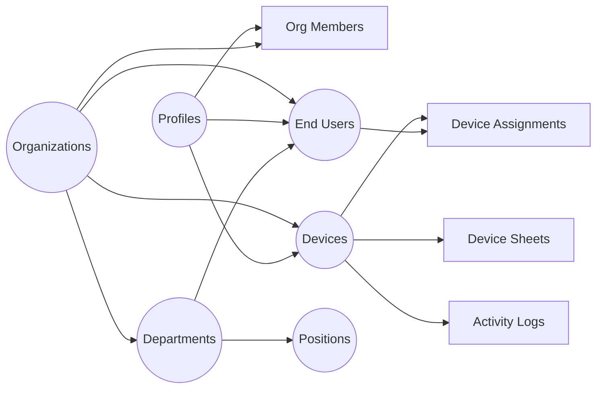

# IT Assets Management — Device Dashboard

Ung dung web quan ly tai san IT (thiet bi, phan cung) xay dung tren **Next.js 16** + **Supabase**. Ho tro multi-tenant, phan quyen RBAC, import/export Excel, so do to chuc, realtime sync, va giao dien Soft Premium voi dark/light mode.

---

## Muc luc

- [Tinh nang chinh](#tinh-nang-chinh)
- [Tech Stack](#tech-stack)
- [Cau truc du an](#cau-truc-du-an)
- [Bat dau](#bat-dau)
  - [Yeu cau he thong](#yeu-cau-he-thong)
  - [1. Clone va Cai dat](#1-clone-va-cai-dat)
  - [2. Thiet lap Database](#2-thiet-lap-database)
  - [3. Cau hinh Environment](#3-cau-hinh-environment)
  - [4. Chay ung dung](#4-chay-ung-dung)
- [Database Schema](#database-schema)
- [He thong phan quyen (RBAC)](#he-thong-phan-quyen-rbac)
- [Docker Deployment](#docker-deployment)
- [Environment Variables](#environment-variables)
- [License](#license)

---

## Tinh nang chinh

### Xac thuc va Phan quyen

| Tinh nang                       | Mo ta                                                                                     |
| ------------------------------- | ----------------------------------------------------------------------------------------- |
| **Xac thuc nguoi dung**         | Dang nhap / Dang ky qua Supabase Auth, bao ve route bang Middleware                       |
| **Multi-tenant (Organization)** | Moi tai khoan thuoc 1 to chuc, du lieu cach ly hoan toan giua cac to chuc qua RLS         |
| **Phan quyen RBAC**             | 4 role: Owner > Admin > Member > Viewer — kiem soat quyen doc/ghi/quan tri                |
| **Quan ly thanh vien**          | Admin+ co the them/xoa thanh vien, thay doi role, reset mat khau (Settings > Permissions) |

### Quan ly Thiet bi

| Tinh nang                   | Mo ta                                                                                               |
| --------------------------- | --------------------------------------------------------------------------------------------------- |
| **CRUD thiet bi**           | Tao, xem, sua, xoa thiet bi voi form accordion va floating card layout                              |
| **Trang chi tiet thiet bi** | Trang rieng `/device/[id]` hien thi thong tin tong quan, thong so ky thuat (JSONB), va sheets       |
| **Dynamic detail cards**    | Hien thi thong tin chi tiet khac nhau tuy theo loai thiet bi (PC, Laptop, v.v.)                     |
| **Device Sheets**           | Quan ly bang tinh (spreadsheet-like) gan voi thiet bi — them/xoa dong, sua cell, doi ten, sap xep   |
| **Import Excel**            | Keo tha file `.xlsx` — ho tro import nhieu files, chon sheets truoc khi import, soft-delete khi loi |
| **Xuat Excel/CSV**          | Xuat du lieu thiet bi ra file CSV (UTF-8 BOM tuong thich Excel)                                     |
| **Thao tac hang loat**      | Chon nhieu thiet bi -> doi trang thai / xoa cung luc                                                |
| **Menu 3-dot actions**      | Menu hanh dong nhanh tren moi dong thiet bi                                                         |
| **Tim kiem va Loc**         | Tim kiem, loc theo trang thai, sap xep, phan trang                                                  |
| **Soft delete**             | Xoa mem thiet bi (luu `deleted_at`), khong mat du lieu vinh vien                                    |

### Quan ly Nhan vien (End-User)

| Tinh nang                      | Mo ta                                                                |
| ------------------------------ | -------------------------------------------------------------------- |
| **CRUD nhan vien**             | Tao ho so nhan vien (ten, email, phone, ghi chu)                     |
| **Ban giao thiet bi**          | Gan thiet bi cho nhan vien (1:1 hoac 1:N), ho tro smart reassignment |
| **Thu hoi thiet bi**           | Thu hoi thiet bi tu nhan vien, tu dong cap nhat trang thai           |
| **Ban giao/Thu hoi hang loat** | Gan hoac thu hoi nhieu thiet bi cung luc                             |
| **Lich su ban giao**           | Theo doi lich su ban giao/thu hoi thiet bi                           |
| **Du lieu cach ly**            | Du lieu nhan vien cach ly theo tai khoan/to chuc                     |

### Phong ban va Chuc vu

| Tinh nang             | Mo ta                                                                                           |
| --------------------- | ----------------------------------------------------------------------------------------------- |
| **Quan ly phong ban** | CRUD phong ban voi cau truc phan cap (parent-child)                                             |
| **Quan ly chuc vu**   | CRUD chuc vu/vi tri cong viec trong phong ban                                                   |
| **So do to chuc**     | Hien thi so do to chuc tuong tac (Organization Chart) su dung @xyflow/react + dagre auto-layout |

### Dashboard va Thong ke

| Tinh nang                       | Mo ta                                                                  |
| ------------------------------- | ---------------------------------------------------------------------- |
| **Dashboard tong quan**         | Bieu do thong ke thiet bi (Recharts), the KPI, hoat dong gan day       |
| **Bieu do trang thai thiet bi** | Chart hien thi phan bo trang thai thiet bi                             |
| **Bieu do phong ban**           | Chart thong ke nhan vien theo phong ban                                |
| **Hoat dong gan day**           | Feed hien thi cac hanh dong gan nhat (import, ban giao, thu hoi, v.v.) |

### Giao dien va Trai nghiem

| Tinh nang                 | Mo ta                                                                            |
| ------------------------- | -------------------------------------------------------------------------------- |
| **Soft Premium UI**       | Giao dien thiet ke phong cach premium, nhat quan toan bo ung dung                |
| **Dark / Light mode**     | Chuyen doi giao dien sang/toi voi hieu ung chuyen doi tron (circular transition) |
| **Theme Customizer**      | Tuy chinh mau sac, border-radius, font, sidebar layout, nhieu theme presets      |
| **Command Palette**       | Tim kiem nhanh va dieu huong bang `Ctrl+K` (cmdk)                                |
| **Breadcrumb navigation** | Dieu huong breadcrumb tren moi trang                                             |
| **Responsive**            | Ho tro mobile va desktop                                                         |
| **Toast notifications**   | Thong bao hanh dong voi soft toast variant (Sonner)                              |
| **Loading states**        | Trang thai loading nhat quan toan project                                        |
| **Empty states**          | Component hien thi khi khong co du lieu                                          |

### He thong va Bao mat

| Tinh nang                 | Mo ta                                                                                     |
| ------------------------- | ----------------------------------------------------------------------------------------- |
| **Realtime sync**         | Supabase Realtime subscriptions cho devices, assignments, end-users — tu dong cap nhat UI |
| **Activity Logs**         | Ghi log moi hanh dong (import, assign, return, v.v.) voi retention 30 ngay                |
| **Cron cleanup**          | API endpoint tu dong xoa log cu hon 30 ngay                                               |
| **Security headers**      | CSP (Content Security Policy), HSTS                                                       |
| **Zod validation**        | Validate du lieu dau vao bang Zod o server-side                                           |
| **requireAuth helper**    | Kiem tra auth + org + role o moi Server Action                                            |
| **Atomic DB operations**  | Su dung Postgres RPC functions de tranh race conditions (JSONB)                           |
| **Row Level Security**    | RLS tren tat ca cac bang, dam bao cach ly du lieu giua cac to chuc                        |
| **Tai lieu huong dan**    | He thong docs tich hop (MDX) voi 7 bai huong dan chi tiet                                 |
| **Vercel Speed Insights** | Theo doi hieu nang ung dung tren production                                               |

---

## Tech Stack

| Lop                    | Cong nghe                                                |
| ---------------------- | -------------------------------------------------------- |
| **Framework**          | Next.js 16.1.1 (App Router), React 19, TypeScript 5.9    |
| **Styling**            | Tailwind CSS 4.x, shadcn/ui (Radix UI), 34 UI components |
| **Backend**            | Supabase (Auth + PostgreSQL + Realtime + RLS)            |
| **State**              | TanStack React Query 5, Zustand 5                        |
| **Forms**              | React Hook Form 7 + Zod 4                                |
| **Data Import/Export** | SheetJS (xlsx) — dynamic import, react-dropzone          |
| **Tables**             | TanStack Table                                           |
| **Charts**             | Recharts 3                                               |
| **Org Chart**          | @xyflow/react 12 + dagre (auto-layout)                   |
| **Docs**               | next-mdx-remote + gray-matter (MDX)                      |
| **Theming**            | next-themes, custom theme customizer                     |
| **Command Palette**    | cmdk                                                     |
| **Testing**            | Vitest, Playwright                                       |
| **Linting**            | ESLint, Prettier, Husky + lint-staged                    |
| **Analytics**          | Vercel Speed Insights                                    |

---

## Cau truc du an

<details>
<summary>Click de xem cau truc thu muc chi tiet</summary>

```
device-dashboard/
├── public/                          # Static assets
├── docker/
│   └── init.sql                     # Database initialization script
├── docs/                            # MDX documentation files (7 guides)
├── src/
│   ├── app/
│   │   ├── (auth)/                  # Auth pages (Sign-in, Sign-up, Error pages)
│   │   │   ├── sign-in/
│   │   │   ├── sign-up/
│   │   │   └── errors/              # 401, 403, 404, 500, Maintenance
│   │   ├── (dashboard)/             # Protected dashboard pages
│   │   │   ├── dashboard/           # Tong quan — KPI cards, charts
│   │   │   ├── devices/             # Danh sach thiet bi
│   │   │   ├── device/[id]/         # Chi tiet thiet bi
│   │   │   ├── end-user/            # Quan ly nhan vien
│   │   │   ├── department/          # Phong ban & Chuc vu
│   │   │   ├── organization/        # So do to chuc
│   │   │   ├── docs/                # Tai lieu huong dan
│   │   │   │   └── [slug]/          # Trang doc rieng
│   │   │   ├── settings/
│   │   │   │   ├── account/         # Cai dat tai khoan
│   │   │   │   ├── appearance/      # Giao dien & Theme
│   │   │   │   ├── history/         # Lich su he thong
│   │   │   │   └── permissions/     # Quan tri & Phan quyen (Admin+)
│   │   │   └── users/               # Quan ly users
│   │   ├── actions/                 # Server Actions (12 files)
│   │   │   ├── auth.ts              # Sign in/up/out
│   │   │   ├── devices.ts           # CRUD + import + bulk ops
│   │   │   ├── device-sheets.ts     # Spreadsheet operations
│   │   │   ├── device-assignments.ts # Ban giao/thu hoi
│   │   │   ├── end-users.ts         # CRUD nhan vien
│   │   │   ├── departments.ts       # CRUD phong ban
│   │   │   ├── positions.ts         # CRUD chuc vu
│   │   │   ├── members.ts           # Quan ly thanh vien org
│   │   │   ├── organization.ts      # Hierarchy cho org chart
│   │   │   ├── activity-logs.ts     # Logs + cleanup
│   │   │   ├── app-stats.ts         # Dashboard stats
│   │   │   └── profile.ts           # Profile + settings
│   │   └── api/
│   │       ├── auth/me/             # GET current user
│   │       └── cron/cleanup-logs/   # Cron xoa log cu
│   ├── components/
│   │   ├── ui/                      # 34 shadcn/ui components
│   │   ├── auth/                    # Auth forms
│   │   ├── dashboard/               # Device, EndUser, Department, Members, OrgChart components
│   │   ├── permission/              # PermissionGate, RoleBadge
│   │   ├── carousel/                # Sheet tabs carousel
│   │   ├── theme-customizer/        # Theme customizer UI
│   │   ├── app-sidebar.tsx          # Sidebar navigation (role-based)
│   │   ├── CommandPalette.tsx       # Ctrl+K command palette
│   │   └── ...                      # Logo, ModeToggle, EmptyState, etc.
│   ├── hooks/
│   │   ├── queries/                 # TanStack Query hooks (devices, endUsers, org, logs, stats)
│   │   ├── mutations/               # TanStack Mutation hooks (devices, endUsers, members)
│   │   ├── usePermission.ts         # RBAC permission hooks
│   │   └── ...                      # Mobile, sidebar, theme hooks
│   ├── stores/                      # Zustand stores (appearance, UI state)
│   ├── contexts/                    # AuthContext, SidebarContext, ThemeContext
│   ├── providers/                   # QueryProvider, RealtimeProvider
│   ├── types/                       # TypeScript definitions (supabase, device, end-user, permission, etc.)
│   ├── lib/                         # Utilities (auth, permissions, excel, export, docs, time, etc.)
│   ├── config/                      # Theme config & presets
│   ├── constants/                   # Device, EndUser, ActivityLog constants
│   └── utils/                       # Supabase client helpers, theme presets
├── test/                            # Test files
├── docker-compose.yml               # Docker services
├── Dockerfile                       # Docker build
├── vercel.json                      # Vercel config
├── vitest.config.ts                 # Vitest config
├── package.json
└── README.md
```

</details>

---

## Bat dau

### Yeu cau he thong

| Phan mem    | Phien ban | Ghi chu                            |
| ----------- | --------- | ---------------------------------- |
| **Node.js** | >= 18.x   | [Tai tai day](https://nodejs.org/) |
| **Docker**  | Latest    | Chi can neu self-host database     |

### 1. Clone va Cai dat

```bash
git clone https://github.com/duacacao/IT_Asset_Management.git
cd device-dashboard
npm install
```

### 2. Thiet lap Database

Xem file `docker/init.sql` de biet cau truc bang can tao tren Supabase hoac Docker Postgres.

### 3. Cau hinh Environment

```bash
cp .env.example .env.local
# Dien NEXT_PUBLIC_SUPABASE_URL va ANON_KEY
```

### 4. Chay ung dung

```bash
npm run dev
# Truy cap: http://localhost:3000
```

---

## Database Schema

<details>
<summary>Click de xem so do Database (9 bang chinh)</summary>

### Tong quan



### 1. `profiles` (App Users)

Nguoi dung dang nhap vao he thong. Lien ket voi `auth.users`.

| Cot                       | Type  | Mo ta                         |
| ------------------------- | ----- | ----------------------------- |
| `id`                      | UUID  | PK, FK -> auth.users          |
| `email`                   | TEXT  | Email                         |
| `full_name`               | TEXT  | Ten hien thi                  |
| `avatar_url`              | TEXT  | Avatar                        |
| `settings`                | JSONB | Cai dat ca nhan (theme, v.v.) |
| `current_organization_id` | UUID  | FK -> organizations           |
| `role`                    | TEXT  | Role hien tai                 |

### 2. `organizations` (To chuc)

Ho tro multi-tenant, moi to chuc co du lieu rieng biet.

| Cot          | Type  | Mo ta           |
| ------------ | ----- | --------------- |
| `id`         | UUID  | PK              |
| `name`       | TEXT  | Ten to chuc     |
| `slug`       | TEXT  | Slug URL        |
| `logo_url`   | TEXT  | Logo            |
| `settings`   | JSONB | Cai dat to chuc |
| `created_by` | UUID  | FK -> profiles  |

### 3. `organization_members` (Thanh vien)

| Cot               | Type | Mo ta                                |
| ----------------- | ---- | ------------------------------------ |
| `id`              | UUID | PK                                   |
| `organization_id` | UUID | FK -> organizations                  |
| `user_id`         | UUID | FK -> profiles                       |
| `role`            | TEXT | `owner`, `admin`, `member`, `viewer` |

### 4. `devices` (Thiet bi)

| Cot               | Type      | Mo ta                         |
| ----------------- | --------- | ----------------------------- |
| `id`              | UUID      | PK                            |
| `code`            | TEXT      | Ma tai san (Unique)           |
| `name`            | TEXT      | Ten thiet bi                  |
| `type`            | TEXT      | Loai thiet bi                 |
| `status`          | TEXT      | `active`, `broken`, `sold`... |
| `specs`           | JSONB     | Thong so ky thuat chi tiet    |
| `location`        | TEXT      | Vi tri                        |
| `purchase_date`   | DATE      | Ngay mua                      |
| `warranty_exp`    | DATE      | Het han bao hanh              |
| `owner_id`        | UUID      | FK -> profiles                |
| `organization_id` | UUID      | FK -> organizations           |
| `deleted_at`      | TIMESTAMP | Soft delete                   |

### 5. `device_sheets` (Bang tinh thiet bi)

| Cot          | Type  | Mo ta             |
| ------------ | ----- | ----------------- |
| `id`         | UUID  | PK                |
| `device_id`  | UUID  | FK -> devices     |
| `sheet_name` | TEXT  | Ten sheet         |
| `sheet_data` | JSONB | Du lieu bang tinh |
| `sort_order` | INT   | Thu tu sap xep    |

### 6. `end_users` (Nhan vien su dung thiet bi)

| Cot               | Type      | Mo ta               |
| ----------------- | --------- | ------------------- |
| `id`              | UUID      | PK                  |
| `full_name`       | TEXT      | Ten nhan vien       |
| `email`           | TEXT      | Email               |
| `phone`           | TEXT      | So dien thoai       |
| `department_id`   | UUID      | FK -> departments   |
| `position_id`     | UUID      | FK -> positions     |
| `organization_id` | UUID      | FK -> organizations |
| `deleted_at`      | TIMESTAMP | Soft delete         |

### 7. `departments` (Phong ban)

| Cot               | Type      | Mo ta                        |
| ----------------- | --------- | ---------------------------- |
| `id`              | UUID      | PK                           |
| `name`            | TEXT      | Ten phong ban                |
| `parent_id`       | UUID      | FK -> departments (phan cap) |
| `organization_id` | UUID      | FK -> organizations          |
| `deleted_at`      | TIMESTAMP | Soft delete                  |

### 8. `positions` (Chuc vu)

| Cot               | Type      | Mo ta               |
| ----------------- | --------- | ------------------- |
| `id`              | UUID      | PK                  |
| `name`            | TEXT      | Ten chuc vu         |
| `department_id`   | UUID      | FK -> departments   |
| `organization_id` | UUID      | FK -> organizations |
| `deleted_at`      | TIMESTAMP | Soft delete         |

### 9. `activity_logs` (Nhat ky hoat dong)

| Cot               | Type      | Mo ta                                         |
| ----------------- | --------- | --------------------------------------------- |
| `id`              | UUID      | PK                                            |
| `action`          | TEXT      | Loai hanh dong (IMPORT, ASSIGN, RETURN, v.v.) |
| `details`         | TEXT      | Chi tiet                                      |
| `device_id`       | UUID      | FK -> devices                                 |
| `user_id`         | UUID      | FK -> profiles                                |
| `organization_id` | UUID      | FK -> organizations                           |
| `created_at`      | TIMESTAMP | Thoi gian                                     |

### Database Functions (RPC)

- `get_my_org_id`, `get_my_org_role` — helper functions
- `add_sheet_row`, `delete_sheet_row`, `update_sheet_cell` — atomic sheet operations
- `reorder_sheets` — batch reorder
- `set_device_visible_sheets` — JSONB merge cho visible sheets
- `merge_profile_settings` — atomic JSONB merge cho profile settings

</details>

---

## He thong phan quyen (RBAC)

4 cap role: **Owner > Admin > Member > Viewer**

| Quyen                                                                      | Owner | Admin | Member | Viewer |
| -------------------------------------------------------------------------- | ----- | ----- | ------ | ------ |
| Xem du lieu (thiet bi, nhan vien, phong ban, logs, stats)                  | Co    | Co    | Co     | Co     |
| Ghi du lieu (CRUD thiet bi, nhan vien, phong ban, ban giao, import/export) | Co    | Co    | Co     | Khong  |
| Quan ly thanh vien (them/xoa/doi role/reset password)                      | Co    | Co    | Khong  | Khong  |
| Quan ly to chuc                                                            | Co    | Co    | Khong  | Khong  |
| Xoa/chuyen to chuc                                                         | Co    | Khong | Khong  | Khong  |

UI tu dong an/hien cac chuc nang dua tren role cua nguoi dung thong qua `PermissionGate` component va `usePermission` hook.

---

## Docker Deployment

Xem file `docker-compose.yml` va `Dockerfile` de chay stack local voi PostgreSQL.

```bash
docker-compose up -d
```

---

## License

[MIT](./License.md)
